# 一、内联html

​	Markdown 语法在解析后实际是转换为html文档后展示的，因此在 Markdown 文件中，你也可以直接嵌入html语句，达到更多基础语法不能实现的效果。常用的html标签有`<center>`，`<sup>`，`<sub>`等

> 你也可以在html标签下使用`style="..."`来改变html的样式，常见的样式，例如边框，字体，颜色等都是得到支持的。但是要注意不是所有的CSS属性都能得到支持。

**示例**

```markdown
<center>居中</center>  

<font face="华文行楷">华文行楷</font>   
<font Size=2>我是几号字来着2</font>  
<font Size=3>我是几号字来着3</font>  
<font Size=4>我是几号字来着4</font>  

<center><font Size=5>居中5号字</font></center>  
<center><font size=5 face="华文行楷">华文行楷居中5号字</font></center>

```

<center>居中<sub>下标</sub><sup>上标</sup></center>  
<font face="华文行楷">华文行楷</font> 

<font Size=2>我是几号字来着2</font>  
<font Size=3>我是几号字来着3</font>  
<font Size=4>我是几号字来着4</font>  

<center><font Size=5>居中5号字</font></center>  
<center><font size=5 face="华文行楷">华文行楷居中5号字</font></center>


# 二、`LaTeX` 公式

Markdown还有一大优势就是可以支持 `LaTeX` 的公式。使用`LaTeX` 公式需要`mathjax`支持，如果无法显示数学公式，请查看你的Markdown编辑器中是否开启了此选项
```  
$ 表示行内公式
$$ 表示整行公式
```

`LaTeX` 公式可以支持我们画出很多特殊符号，例如，在很多情况下，我们需要使用到箭头符号：

`$\longrightarrow$`			表示为$\longrightarrow$

​	这部分涉及到的内容较多，更多内容可以查看[LATEX使用参考](LATEX使用参考.md)

# 三、内容目录

Markdown还有一个很方便的功能，就是可以根据标题自动生成目录。
在段落中填写 `[TOC]` 以显示全文内容的目录结构

# 四、画图

​	Markdown可以满足轻量的画图需求，常用的编辑语法有`mermaid`、`flow`等。要支持画图功能，也可能需要在编辑器中进行设置。

## mermaid

### graph（流程图）

> * **节点名不能与关键字同名**
> *  **使用引号可以避免一些不必要的麻烦，如避免与关键字同名**

关键字graph表示一个流程图的开始，同时需要指定该图的方向

#### 图方向

- TB，从上到下
- TD，从上到下
- BT，从下到上
- RL，从右到左
- LR，从左到右

```
graph LR
  A-->B
  B-->C
  C-->D
  D-->A
```

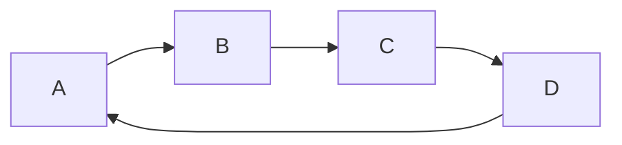

#### 节点形状

- 圆角节点

  ```
  flowchart LR
  	id1(text)
  ```

  ```mermaid
  flowchart LR
  	id1(text)
  ```
- 体育场形节点

    ```
    flowchart LR
    	id1([text])
    ```

    ```mermaid
    flowchart LR
    	id1([text])
    ```

- 子例程节点

    ```
    flowchart LR
    	id1[[text]]
    ```

    ```mermaid
    flowchart LR
    	id1[[text]]
    ```

- 圆柱体节点

    ```
    flowchart LR
    	id1[(text)]
    ```

    ```mermaid
    flowchart LR
    	id1[(text)]
    ```

- 圆形节点

    ```
    flowchart LR
    	id1((text))
    ```

    ```mermaid
    flowchart LR
    	id1((text))
    ```

- 非对称节点

    ```
    flowchart LR
    	id1>text]
    ```

    ```mermaid
    flowchart LR
    	id1>text]
    ```

- 菱形节点

    ```
    flowchart LR
    	id1{text}
    ```

    ```mermaid
    flowchart LR
    	id1{text}
    ```

- 六角形节点

    ```
    flowchart LR
    	id1{{text}}
    ```

    ```mermaid
    flowchart LR
    	id1{{text}}
    ```

- 平行四边形节点

    ```
    flowchart LR
    	id1[/text/]
    ```

    

    ```mermaid
    flowchart LR
    	id1[/text/]
    ```

- 反转平行四边形节点

    ```
    flowchart LR
    	id1[\text\]
    ```

    ```mermaid
    flowchart LR
    	id1[\text\]
    ```

- 梯形节点

    ```
    flowchart LR
    	id1[/text\]
    ```

    ```mermaid
    flowchart LR
    	id1[/text\]
    ```

- 反转梯形节点

    ```
    flowchart LR
    	id1[\text/]
    ```

    ```mermaid
    flowchart LR
    	id1[\text/]
    ```

- 双圆形节点

    ```
    flowchart LR
    	id1(((text)))
    ```

    ```mermaid
    flowchart LR
    	id1(((text)))
    ```
    
- 连线

节点间的连接线有多种形状，可以在连接线中加入标签：

```
箭头连接 A1–->B1
开放连接 A2—B2
标签连接 A3–text—B3
箭头标签连接 A4–text–>B4
虚线开放连接 A5.-B5
虚线箭头连接 A6-.->B6
标签虚线连接 A7-.text.-B7
标签虚线箭头连接 A8-.text.->B8
粗线开放连接 A9===B9
粗线箭头连接 A10==>B10
标签粗线开放连接 A11==text===B11
标签粗线箭头连接 A12==text==>B12
```

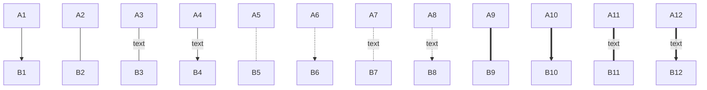

> 在连线中输入一些字符时，可能会出错（如`=`,`>`等），此时可以用双引号框住标签中的内容

**补充连接**

​	在一些情况下，可以用&符号简化连接

```
graph LR
	a --> b & c --> d
```


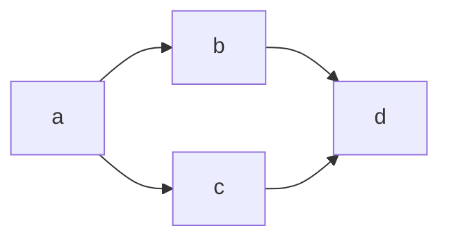

```
graph TB
	A & B --> C & D
```

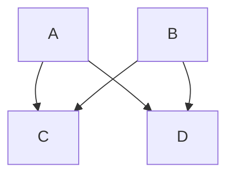

#### subgraph（子图）

**格式**

```
# 外面的那层, 可以使用子图中的节点，子图中的节点名不是隔离的，可以认为是全局变量-.-
graph LR
  subgraph title1
    graph definition 
  end
  subgraph title2
    graph definition 
  end
  ...
```

示例

```
graph LR
  subgraph g1
    a1-->b1
  end
  subgraph g2
    a2-->b2
  end
  subgraph g3
    a3-->b3
  end
  a3-->a2
```

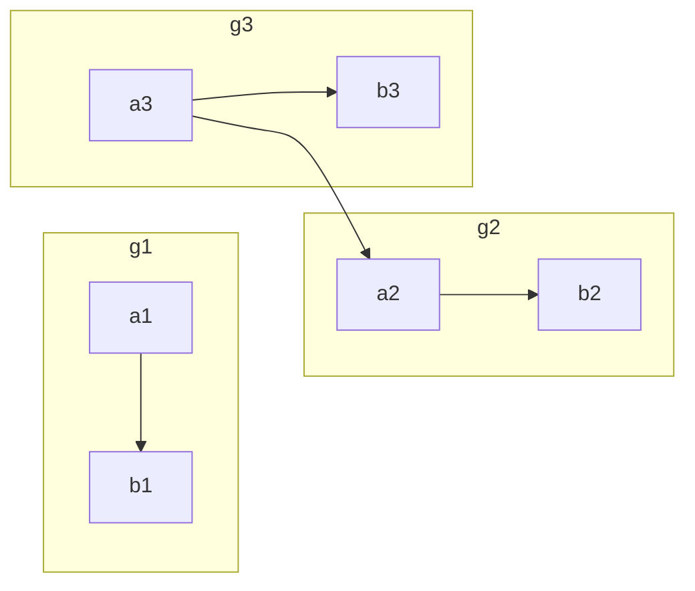

### sequence diagram（序列图）

序列图的声明语句是`sequenceDiagram`，它的关键字有：

* participant，参与者，相当先定义模块，它不必须要在代码中声明，但可通过设定参与者(participant)的顺序控制展示顺序

* note， 便签，格式如下
```
note [right of | left of][Actor]:Text

# 给多个模块做标签, 通过逗号分割

note over [Actor1, Actor2...]:Text
```

* 循环

```
loop Loop_text
... statements...
end
```

* 选择

```
alt Describing_text
...statements...
else
...statements...
end

# 推荐在没有else的情况下使用 opt(option,选择)

opt Describing_text
...statements...
end
```
**示例：**

```
sequenceDiagram
　　Alice->>Bob: Hello Bob, how are you?
　　alt is sick
　　　　Bob->>Alice:not so good :(
　　else is well
　　　　Bob->>Alice:good
　　end
　　opt Extra response
　　　　Bob->>Alice:Thanks for asking
　　end
```

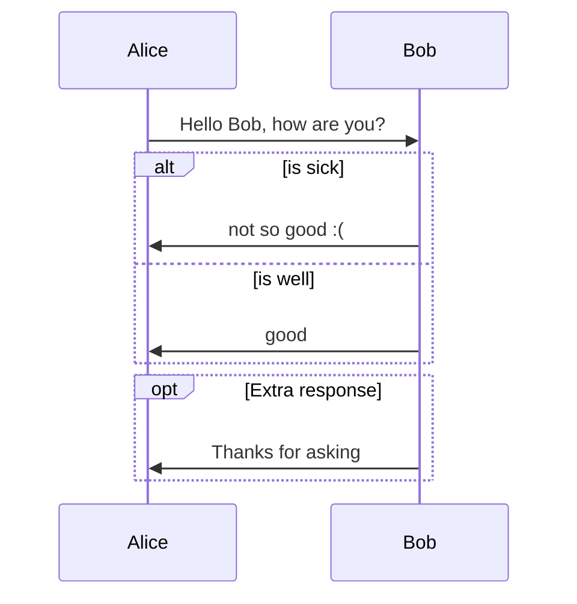

* 连线
  * 无箭头实线 ->
  * 有箭头实线 ->>
  * 无箭头虚线 –>
  * 有箭头虚线 –>>
  * 带x实线 -x
  * 带x虚线 –x

如：

```
sequenceDiagram
  Note right of A: 倒霉, 碰到B了
  A->B:   Hello B, how are you ?
  note left of B: 倒霉,碰到A了
  B-->A:  Fine, thx, and you?
  note over A,B: 快点溜，太麻烦了
  A->>B:  I'm fine too.
  note left of B: 快点打发了A
  B-->>A: Great!
  note right of A: 溜之大吉
  A-xB:   Wait a moment
  loop Look B every minute
　  A->>B: look B, go?
　　B->>A: let me go?
　end
　B--xA: I'm off, byte 　
  note right of A: 太好了, 他走了
```

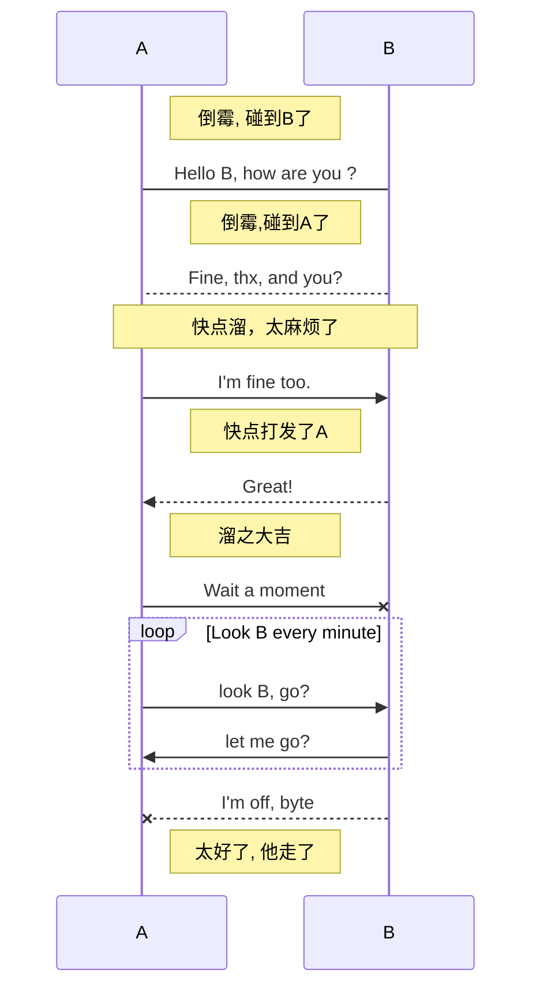

### gantt diagram（甘特图）

​	甘特图是一类条形图，由Karol Adamiechi在1896年提出, 而在1910年Henry Gantt也独立的提出了此种图形表示。通常用在对项目终端元素和总结元素的开始及完成时间进行的描述 

关键字如下：

|   title    |     表示     |
| :--------: | :----------: |
| dateFormat |   日期格式   |
|  section   |     模块     |
| completed  |   已经完成   |
|   Active   | 当前正在进行 |
|   future   |  后续待处理  |
|    crit    |   关键阶段   |

**示例：**

```
gantt
dateFormat YYYY-MM-DD
section S1
T1: 2020-04-01, 9d
section S2
T2: 2020-04-11, 9d
section S3
T3: 2020-04-02, 9d
```

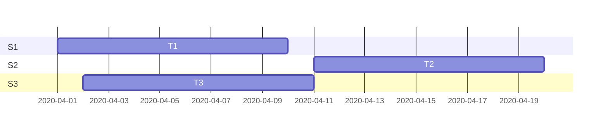

```
gantt
    dateFormat  YYYY-MM-DD
    title Adding GANTT diagram functionality to mermaid

    section A section
    Completed task            :done,    des1, 2020-04-06,2020-04-08
    Active task               :active,  des2, 2020-04-09, 3d
    Future task               :         des3, after des2, 5d
    Future task2               :         des4, after des3, 5d

    section Critical tasks
    Completed task in the critical line :crit, done, 2020-04-06,24h
    Implement parser and jison          :crit, done, after des1, 2d
    Create tests for parser             :crit, active, 3d
    Future task in critical line        :crit, 5d
    Create tests for renderer           :2d
    Add to mermaid                      :1d

    section Documentation
    Describe gantt syntax               :active, a1, after des1, 3d
    Add gantt diagram to demo page      :after a1  , 20h
    Add another diagram to demo page    :doc1, after a1  , 48h

    section Last section
    Describe gantt syntax               :after doc1, 3d
    Add gantt diagram to demo page      : 20h
    Add another diagram to demo page    : 48h
```

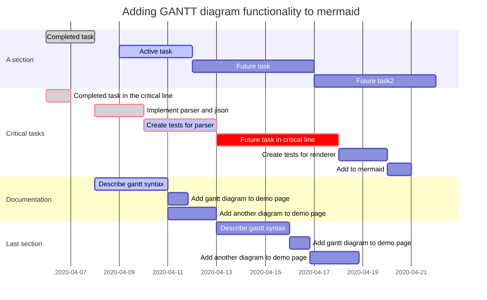

### class（类图）

​	在软件工程中，统一建模语言中的类图(UML)是一种静态结构图，通过显示系统的类、属性、操作(或方法)以及对象之间的关系来描述系统的结构。类图是面向对象建模的主要构件。它用于应用程序结构的一般概念建模，并用于将模型转换为编程代码的详细建模。类图还可以用于数据建模。类图中的类表示主要元素、应用程序中的交互以及要编程的类。

​	下面是用mermaid呈现的类图

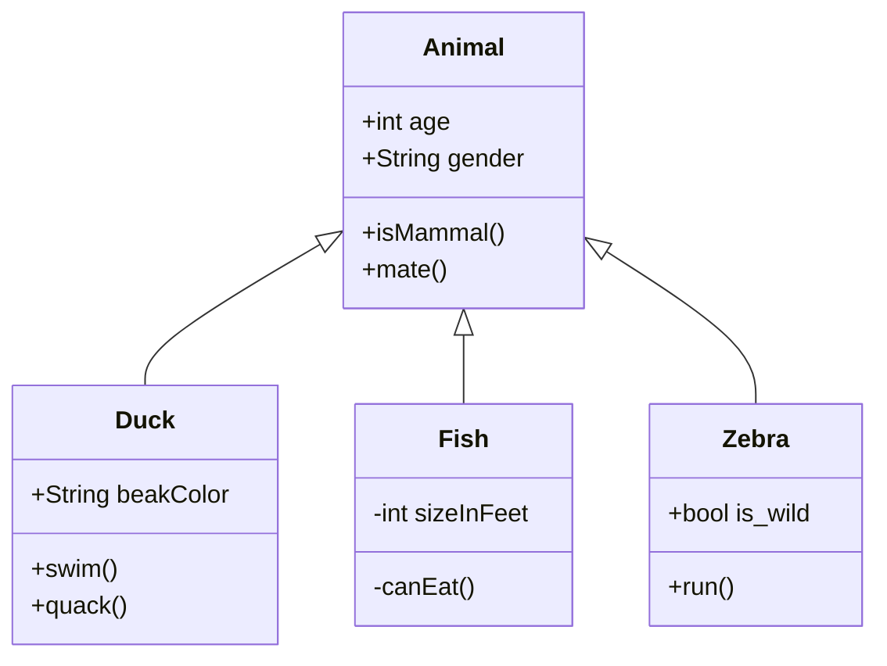

​	一个类图包含三个部分：

- 顶部是类的名称，它以粗体和居中印刷，第一个字母大写，它还可以包含描述类的性质的可选注释文本。
- 中间隔间包含类的属性，它是左对齐的，第一个字母小写
- 底部隔间包含类可以执行的方法，格式同上

#### 定义类和类的成员

​	有两种定义类的方法

- 使用`class A`，显式地定义一个类
- 使用类之间的连接符号`A <|-- B`，它可以一次定义两个类以及它们间的关系，表示B继承了A

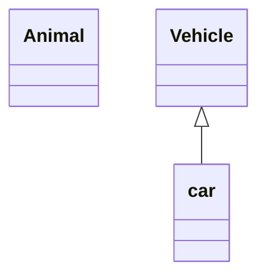

​	类图根据是否存在`()`来区分属性和方法，具有`()`的被视为方法，其它的视为属性。

​	有两种定义类的成员的方法

- 使用`类名 : 成员名称`的方式，用于一次定义一个成员
- 使用`类名{成员列表}`，可以同时定义多个成员

> 在方法的后面可以增加返回类型，方法与返回类型之间必须有一个空格

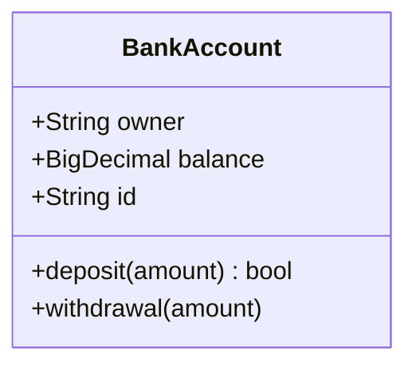

#### 类的关系

```
classDiagram
classA <|-- classB	继承
classC *-- classD	组合
classE o-- classF	聚合
classG <-- classH	关联
classI -- classJ	连接(实线) 可靠的
classK <.. classL	依赖
classM <|.. classN	实现
classO .. classP	连接(虚线) 已销毁
```

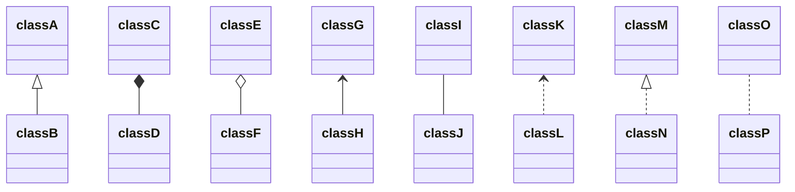

​	此外，在连接关系的后面可以使用 `:` 来描述两个类之间关系的性质，描述方法为`[classA][Arrow][ClassB]:LabelText`

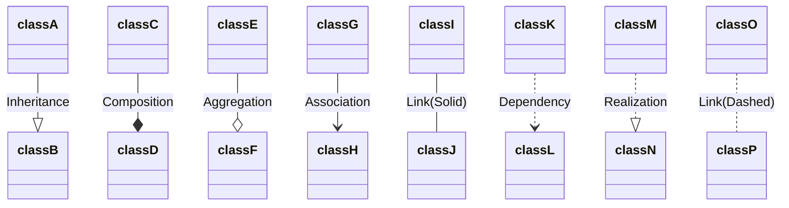

#### 数量关系

​	多重符号(Multiplicity notations)放置在关联语句中，通过在箭头之前或之后放置“引号”，来定义基数。

​	不同的基数选项是:

- `1` 只有一个
- `0..1` 零个或一个
- `1..*` 一个或多个
- `*` 多个
- `n` N {其中 n > 1}
- `0..n`0到 n {其中 n > 1}
- `1..n` 1到 n {其中 n > 1}

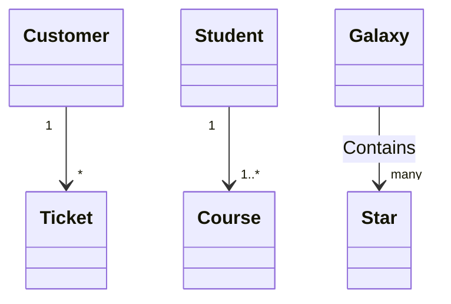


#### 其它规则

- 可以在类中使用泛型(模板)

​	泛型可以表示为类定义的一部分，也可以表示为方法/函数的参数或返回值，但是不支持泛型套泛型

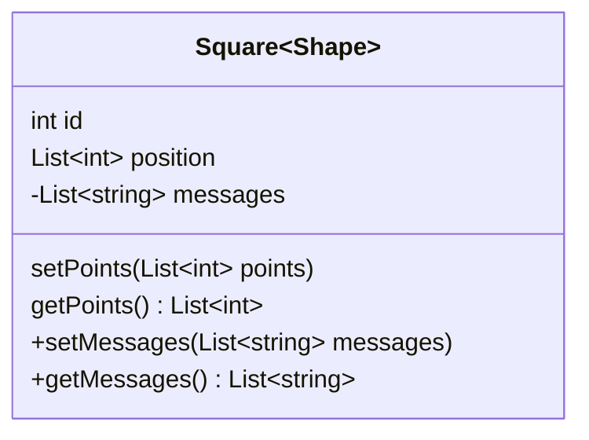

- 可见性

​	用以下的符号表示属性/方法的可见性，它们放在名称之前

> - `+` Public 
> - `-` Private 
> - `#` Protected 
> - `~` Package/Internal 

​	此外，还可以在方法的末尾添加以下符号表示虚拟和静态方法，在属性末尾添加`$`表示静态属性。

> - `*` Abstract   `someAbstractMethod()*`
> - `$` Static  `someStaticMethod()$`

- 类的注释

​	可以使用标记对类进行注释，以提供关于该类的其他元数据。这可以更清楚地说明它的性质。一些常见的注释包括:

> - `<<Interface>>` To represent an Interface class 表示 Interface 类
> - `<<Abstract>>` To represent an abstract class 表示抽象类
> - `<<Service>>` To represent a service class 表示服务类
> - `<<Enumeration>>` To represent an enum 表示枚举

​	有两种添加注释的方法：

> - 在单独的一行添加注释，`注释语句 类名`
> - 在类的嵌套声明中进行注释

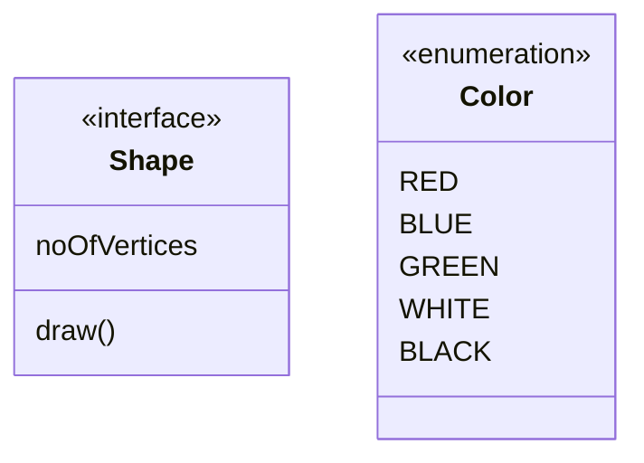

**设置图表方向**

​	在类图中，可以使用direction来设置图将呈现的方向

```
classDiagram
  direction RL
  ...
```

#### 互动

​	可以将单击事件绑定到节点。单击可以导致 javascript 回调或链接，该链接将在新的浏览器选项卡中打开。注意: 在使用 securityLevel = ‘ strong’时禁用此功能，在使用 securityLevel = ‘ lose’时启用此功能。

在声明了所有类之后，在单独的一行上定义这些操作。

```
action className "reference" "tooltip"
- action 表示link或callback，具体取决于要调用的交互类型
- calssName 与操作关联的节点id
- reference url链接，或者回调函数的名称
- optional 可选项，tooltip是当鼠标悬停时显示的提示字符串
click className call callback() "tooltip"
click className href "url" "tooltip"
```

**例子**

*URL Link:*

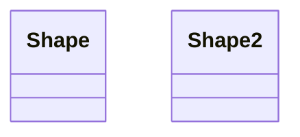

*Callback:*


## flow（流程图）

​	先自定义变量，然后用箭头符号将变量连接起来。

**关键字**

* `start/end`，表示程序的开始与结束
* `operation`，表示程序的处理块
* `subroutine`，表示子程序块
* `condition`，表示程序的条件判断
* `inputoutput`，表示程序的出入输出
* `right/left`，表示当前连线在当前模块上的起点(默认从下端开始)
* `yes/no`， 表示condition判断的分支(可以和right，left同时使用)

通过定义模块与连接，再结合以上关键词即可定义简单流程图的各个模块。

**模块定义**

`模块标识(相当于变量名)=>模块关键字(模块的类型):模块名称(图中显示的文字)`

**连接定义**

```
模块标识1->模块标识2
模块标识1->模块标识2->模块标识3
```

> * 进行连接的时候，可以通过`right`，`left`确定箭头的起点。
>
> * 使用`condition`关键词定义的判断框的连接需要结合yes或者no使用

```
# 先自定义变量,然后画图
st=>start: 开始
e=>end: 结束
op=>operation: 输入x
sub=>subroutine: 是否重新输入
cond1=>condition: x>0?
cond2=>condition: yes/no 
io=>inputoutput: 输出x  

st(right)->op->cond1
cond1(yes)->io(right)->e
cond1(no)->sub(right)->cond2()
cond2(yes, right)->op
cond2(no)->e
```

```flow
st=>start: 开始
e=>end: 结束
op=>operation: 输入x
sub=>subroutine: 是否重新输入
cond1=>condition: x>0?
cond2=>condition: yes/no 
io=>inputoutput: 输出x  

st(right)->op->cond1
cond1(yes)->io(right)->e
cond1(no)->sub(right)->cond2()
cond2(yes, right)->op
cond2(no)->e

```


